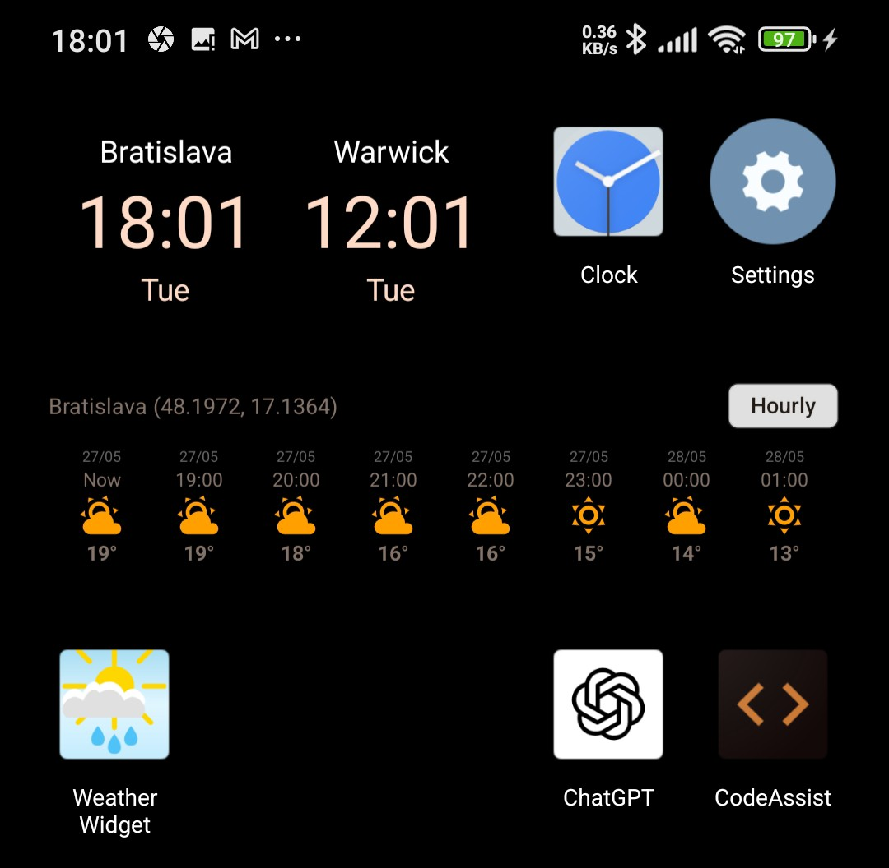

# Weather Widget for Android 🌦️

A modern Android weather widget that displays real-time weather forecasts directly on your home screen. Features both hourly and daily forecast modes with automatic location detection or custom location selection.

[](https://android.com)
[](https://android-arsenal.com/api?level=24)
[](https://kotlinlang.org)
[](https://open-meteo.com/)

## ✨ Features

- 🌡️ **Dual Forecast Modes**: Switch between hourly (48h) and daily (16d) weather forecasts
- 🗺️ **Smart Location**: GPS auto-detection or worldwide city search
- 🌍 **Real Weather Data**: Live data from Open-Meteo API (no API key required)
- ⏰ **Hourly Precision**: Shows weather at exact hour intervals (14:00, 15:00, etc.)
- 🎨 **12 Weather Icons**: Visual indicators for all weather conditions
- 📱 **Home Screen Widget**: Compact design that fits perfectly on your launcher
- 🔄 **Auto-Refresh**: Smart caching with automatic data updates
- 🌐 **Offline Fallback**: IP-based location when GPS unavailable

## 📱 Screenshots

### Widget Forecast Modes
| Hourly Forecast (48 hours) | Daily Forecast (16 days) |
|:---:|:---:|
|  |  |
| Shows weather every hour with precise timing | Shows daily max/min temps with weather icons |

### App Configuration
| Main Interface | Weather Icons Legend |
|:---:|:---:|
|  |  |
| GPS/Custom location setup with neumorphic design | Complete guide to all 12 weather condition icons |

### 📦 Download & Install

1. **Download APK**
   - Go to [Releases](../../releases) page
   - Download the latest `weather-widget-vX.X.apk`
   - Install on your Android device

2. **Add Widget**
   - Long press on home screen → "Widgets"
   - Find "Weather Widget" and drag to home screen
   - Configure location in the main app

**For Developers:** See [RELEASE_GUIDE.md](RELEASE_GUIDE.md) for creating new releases.

### 🔧 Build from Source

**Prerequisites:**
- Android Studio Arctic Fox or newer
- Android SDK 24+ 
- Java 17+ (Java 21 also supported)

**Build Steps:**
```bash
# Clone repository
git clone https://github.com/yourusername/weather-widget.git
cd weather-widget

# Build debug APK
./gradlew assembleDebug

# Install to connected device
./gradlew installDebug
```

**Output:** `app/build/outputs/apk/debug/app-debug.apk`

## 📋 Usage

### Widget Modes
- **Toggle Button**: Tap "Hourly/Daily" on widget to switch between forecast modes
- **Hourly Mode**: Shows 48 hours of weather (6 rows × 8 hours)
- **Daily Mode**: Shows 16 days of weather (2 rows × 8 days)

### Location Configuration

**Option 1: GPS Auto-Detection** 🛰️
1. Open the app
2. Grant location permissions
3. Select "Use GPS Location"
4. Widget automatically updates with your current location

**Option 2: Custom Location** 🗺️
1. Open the app  
2. Select "Use Custom Location"
3. Search for any city (type 2+ characters)
4. Tap your desired location from results
5. Widget uses this fixed location

### Widget Features
- **Real-time Updates**: Data refreshes every 2 hours
- **Time Display**: Shows ":00" format for hourly forecasts (aligns with server data)
- **Weather Icons**: 12 different icons based on WMO weather codes
- **Temperature Range**: Daily mode shows max/min temps

## ⚙️ Technical Details

### Tech Stack
- **Language**: Kotlin 100%
- **Min SDK**: Android 7.0 (API 24)
- **Target SDK**: Android 14 (API 35)
- **Architecture**: MVVM with AppWidget Provider

### 🔧 Key Components
| Component | Purpose |
|-----------|---------|
| `WeatherService.kt` | Real weather data fetching from Open-Meteo API |
| `ForecastWidgetService.kt` | Widget data processing and display logic |
| `HelloWidgetProvider.kt` | Main widget provider and update manager |
| `LocationManager.kt` | GPS/network location and city search |
| `MainActivity.kt` | Configuration UI with neumorphic design |

### 🌐 APIs & Services
- **[Open-Meteo](https://open-meteo.com/)**: Weather forecast data (no API key needed)
- **[BigDataCloud](https://www.bigdatacloud.com/)**: Reverse geocoding
- **[Nominatim OSM](https://nominatim.openstreetmap.org/)**: City search
- **[Geolocation-DB](https://geolocation-db.com/)**: IP-based location fallback

### 📱 Permissions Required
```xml
<uses-permission android:name="android.permission.INTERNET" />
<uses-permission android:name="android.permission.ACCESS_FINE_LOCATION" />
<uses-permission android:name="android.permission.ACCESS_COARSE_LOCATION" />
```

## 👨‍💻 Development

### 📁 Project Structure
```
app/src/main/java/com/jozefhalaga/weatherwidget/
├── MainActivity.kt                  # Configuration UI
├── HelloWidgetProvider.kt           # Main widget provider
├── ForecastWidgetService.kt         # Widget data & display logic  
├── WeatherService.kt                # Weather API integration
└── WeatherLocationManager.kt        # Location & search services

app/src/main/res/
├── layout/
│   ├── activity_main.xml           # Main app layout
│   ├── hello_widget.xml            # Widget layout  
│   └── forecast_item.xml           # Individual forecast items
├── drawable/                       # 12 weather icons + app icon
└── values/                         # Strings, colors, styles
```

### 🔨 Development Commands
```bash
# Build & install debug
./gradlew installDebug

# Build release APK  
./gradlew assembleRelease

# Run tests
./gradlew test

# Clean build
./gradlew clean
```

### 🧩 Widget Architecture
- **Real Data**: Live weather from Open-Meteo API (no more demo data!)
- **Smart Caching**: 2-hour cache to minimize API calls
- **Time Alignment**: Hourly forecasts show exact ":00" times from server
- **Fallback Hierarchy**: GPS → Network → IP-based → Error state
- **Dual Modes**: Toggle between hourly/daily forecasts

## 🤝 Contributing

Contributions welcome! Please:

1. **Fork** the repository
2. **Create** a feature branch (`git checkout -b feature/amazing-feature`)
3. **Commit** changes (`git commit -m 'Add amazing feature'`)
4. **Push** to branch (`git push origin feature/amazing-feature`)
5. **Open** a Pull Request

### 🐛 Issues
Found a bug? Please [open an issue](../../issues) with:
- Device model & Android version
- Steps to reproduce
- Expected vs actual behavior
- Screenshots (if applicable)

## 📄 License

This project is **open source** and available under the MIT License.

## 🙏 Acknowledgments

- **[Open-Meteo](https://open-meteo.com/)** - Free weather API (no key required!)
- **[BigDataCloud](https://www.bigdatacloud.com/)** - Geocoding services  
- **[OpenStreetMap Nominatim](https://nominatim.openstreetmap.org/)** - City search
- **[Material Design](https://material.io/)** - Design system
- **Weather icons** - Custom designed for clarity and recognition

## 📈 Changelog

### v3.0 - Real Weather Integration ✨
- 🌍 **Real weather data** from Open-Meteo API (no more demo data!)
- ⏰ **Hourly precision** - shows exact ":00" times aligned with server
- 🔄 **Smart caching** - 2-hour cache to minimize API calls
- 🗂️ **Dual forecast modes** - toggle between hourly (48h) and daily (16d)
- 🛰️ **Enhanced location services** - better GPS and city search
- 🐛 **Bug fixes** - proper time alignment and error handling

### v2.1 - Visual Enhancement
- 🎨 Added 12 weather icons based on WMO codes
- 📖 Interactive weather legend in app
- ✨ Enhanced visual representation

### v2.0 - Location Improvements  
- 🔍 Improved city search functionality
- 🌏 Better international location handling
- 🎨 UI improvements and bug fixes

### v1.0 - Initial Release
- 📱 Basic weather widget functionality
- 📍 GPS and custom location support

---

## ⭐ Star this repo if you find it useful!

Made with ❤️ for the Android community


